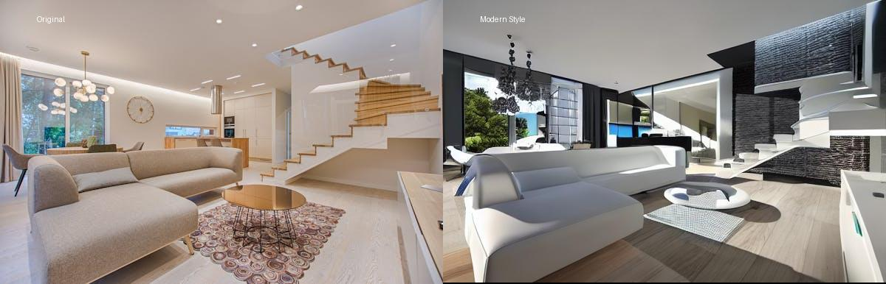
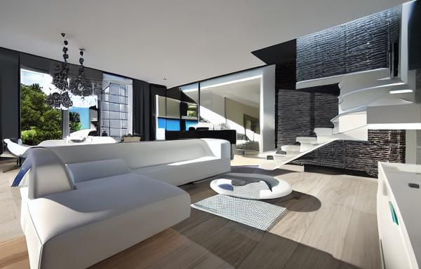
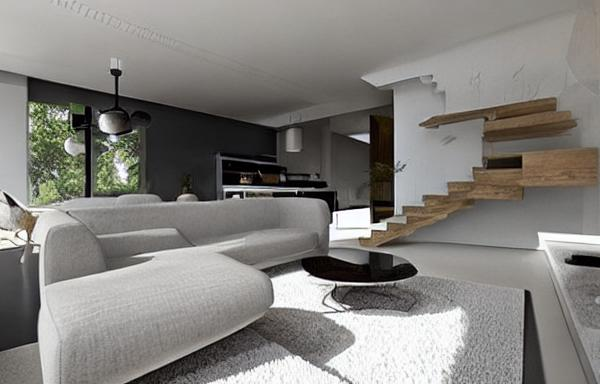
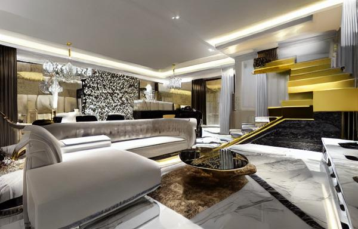
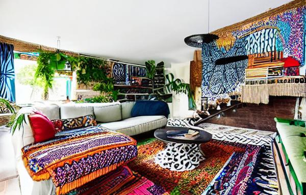
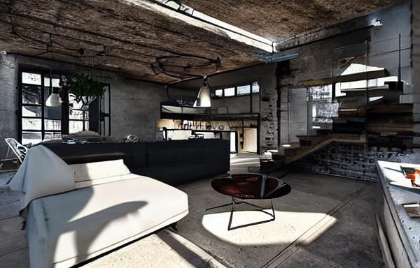
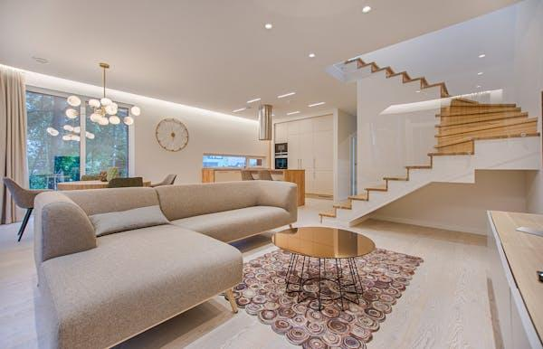
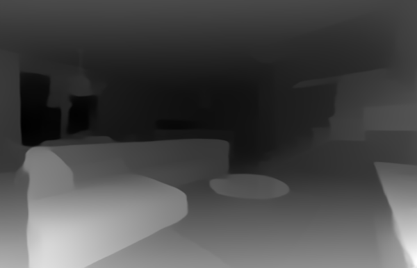

# 🏠 AI-Powered Room Redesign System
### Complete Computer Vision & Generative AI Pipeline

## 📋 Project Overview
An end-to-end AI system that automatically redesigns room images using depth estimation, segmentation, and generative AI. The system processes input room images and generates redesigned versions in 6 different interior design styles.

## 🎯 Features
- **Depth Map Generation** (Member 1): Creates depth maps to preserve room geometry
- **Object Segmentation** (Member 2): Identifies furniture and objects for controlled redesign
- **Prompt Engineering** (Member 3): Automatically generates design prompts for 6 styles
- **Image Generation** (Member 4): Creates redesigned rooms using AI
- **Web Interface** (Member 5): Interactive gallery with side-by-side comparisons

## 🎨 Available Styles
- Modern
- Minimal
- Luxury
- Bohemian
- Industrial
- Scandinavian

## 📁 Project Structure
AI-projects/
├── member1_depth/ # Depth map generator (MiDaS)
├── member2_masks/ # Segmentation mask generator (DeepLabV3)
├── member3_prompts/ # Prompt engineering system
├── member4_images/ # Image generation pipeline
├── member5_ui/ # Flask web interface
├── data/
│ ├── input_images/ # Original room images
│ ├── depth_maps/ # Generated depth maps
│ ├── masks/ # Object segmentation masks
│ ├── prompts/ # Redesign prompts (6 styles)
│ └── outputs/
│ └── images/ # Redesigned room images (18 files)
└── requirements.txt # Python dependencies

## 🎨 REAL AI-Generated Samples

Here are actual images generated using the Stable Diffusion + ControlNet pipeline:

### Before/After Comparison


### All 6 Design Styles

| Modern | Minimal | Luxury |
|--------|---------|--------|
|  |  |  |

| Bohemian | Industrial | Scandinavian |
|----------|------------|--------------|
|  |  |  |

### Original Image & Depth Map
| Original Room | Depth Map |
|---------------|-----------|
|  |  |

## 🛠️ Technologies Used
- **Python 3.11**
- **PyTorch & torchvision** - Deep learning framework
- **Transformers & Diffusers** - AI models
- **OpenCV & PIL** - Image processing
- **Flask** - Web framework
- **NumPy & Matplotlib** - Data handling
- **MiDaS** - Depth estimation
- **DeepLabV3** - Image segmentation
- **Stable Diffusion** - Image generation

## 🚀 Quick Start

### 1. Clone the Repository
```bash
git clone https://github.com/YOUR-USERNAME/AI-projects.git
cd AI-projects
2. Create Virtual Environment
python -m venv venv
venv\Scripts\activate     # Windows
source venv/bin/activate  # Mac/Linux
3. Install Dependencies
pip install -r requirements.txt
4. Run the Web Interface
cd member5_ui
python app.py
5. Open Browser
Navigate to: http://localhost:5000
📊 Output
3 original room images processed

18 redesigned images generated (3 rooms × 6 styles)

Interactive web gallery for comparison
👨‍💻 Author
Muhammad Latif - Computer Systems Engineer
📄 License
MIT License
